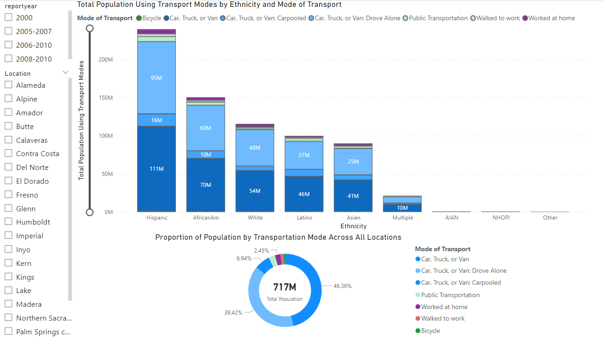

# Azure Real-Time Streaming Data Pipeline with Stream Analytics, Event Hub, SQL Database, and Power BI Visualizations

## Project Description

This project showcases my ability to create a **high-performance, scalable data pipeline** for **real-time streaming and batch processing** using **Azure Stream Analytics**, **Azure Event Hub**, and **Azure SQL Database**. It replicates the type of **real-world streaming data solutions** used by leading tech companies to handle vast data flows, delivering **real-time insights** and **seamless data transformation**. Designed to process data from various sources such as **transportation**, **geolocation**, and **user interactions**, this pipeline integrates multiple Azure services to provide an end-to-end data solution.

## Architecture Diagram


## Table of Contents

1. [Project Description](#project-description)
2. [Batch Processing](#batch-processing)
3. [Stream Processing](#stream-processing)
4. [Technologies Used](#technologies-used)
5. [Usage](#usage)
6. [File Structure](#file-structure)
7. [Power BI Visualizations](#power-bi-visualizations)
8. [What I Learned](#what-i-learned)
9. [Improvements (If I Had More Time)](#improvements-if-i-had-more-time)
10. [License](#license)

## Batch Processing

The **batch processing** component of the pipeline is designed to handle data at scale. By setting up **Azure Stream Analytics** to process incoming data from **Azure Event Hub** and write it to **Azure SQL Database**, we can efficiently process large volumes of data and store them for analysis. Using **Azure API Gateway** as the entry point, the batch workflows effectively capture, transform, and store data, providing a comprehensive historical view that complements the real-time analysis.

## Stream Processing

The **real-time streaming** component of this project is built to handle **live data** in motion, using **Azure Stream Analytics** to process data from **Azure Event Hub**. It delivers immediate insights, with the processed data being stored directly in **Azure SQL Database** for continuous analytics and decision-making. This real-time capability mirrors the needs of dynamic business environments, such as **predictive analytics** and **real-time dashboards**, enabling fast and informed decision-making.

## Technologies Used

- **Azure Event Hub**: A **scalable data streaming platform** capable of handling millions of events per second, ideal for real-time data ingestion.
- **Azure Stream Analytics**: A **fully managed real-time analytics service** used to process streaming data with near-zero latency.
- **Azure SQL Database**: A **high-performance relational database** for storing processed data, ensuring reliable and secure data management.
- **Azure API Gateway**: Manages APIs for seamless data flow between components, providing **controlled and secure access**.
- **Python**: Utilized for **scripting and automation**, particularly for ingesting data into Azure Event Hub.
- **Power BI**: Creates **interactive visualizations** of the processed data, turning complex datasets into actionable insights.

## Usage

### Data Ingestion
- Data from various sources is sent to **Azure Event Hub**, where it is aggregated and prepared for further processing.

### Data Transformation
- **Azure Stream Analytics** is used to transform and aggregate incoming data in real-time, including **data cleansing**, **enrichment**, and **aggregation** before writing to SQL tables.

### Data Storage
- Processed data is stored in **Azure SQL Database**, ready for use in analytics and visualization tools.

### Execution
- **Azure Stream Analytics** manages **real-time data streaming** and processing, while **Power BI** offers a platform for data visualization, turning insights into an accessible format.

## File Structure

```
azure-streaming-data-pipeline/
├── .gitignore
├── Architecture.avif                      # Cloud architecture diagram illustrating the complete data pipeline
├── README.md                              # Detailed documentation of the project
├── transport_stream.py                    # Python script to send data to Azure Event Hub for streaming
├── transportation.csv                     # Sample dataset used for data ingestion
├── Transport Data Visualisation           # Power Bi visualisations of transport data
```

## Power BI Visualizations

### Overview
This project features interactive **Power BI visualizations** to provide **actionable insights** from the streaming and batch data. The visualizations were designed to help decision-makers quickly identify trends and patterns within the transportation data.

#### Key Insights Provided:
- **Total Population Using Transport Modes by Ethnicity and Mode of Transport**: A comprehensive breakdown of transport mode preferences across different ethnicities, which can provide insights into demographic patterns and preferences.
  
- **Proportion of Population by Transportation Mode**: A visual overview showing the breakdown of various modes of transportation used across the dataset.
  

These visualizations offer a clear, **data-driven story** about the movement and preferences of various demographics, which can be crucial for planning and optimization in urban transportation management.

### Download the Full Report
For an interactive experience, you can download the full **Power BI report** [here](./Power_BI/Azure_Streaming_Report.pbix).

## What I Learned

- **Real-time stream processing**: Developed expertise in processing **real-time data streams** using **Azure Event Hub** and **Azure Stream Analytics**, which is crucial for building reactive data systems.
- **Batch processing**: Enhanced my skills in managing **batch workflows** for large data sets, integrating historical and real-time analysis for more holistic insights.
- **Data transformation**: Learned how to perform **complex data transformations** using **SQL** and **Stream Analytics**, making the data useful for both operational and analytical workloads.
- **Azure Integration**: Gained in-depth experience in integrating **Azure services** into a **unified data pipeline**, enhancing scalability, performance, and security.
- **Big Data management**: Developed capabilities to **manage, clean, and store large-scale datasets** in **Azure SQL Database**, crucial for both historical analysis and real-time reporting.

## Improvements (If I Had More Time)

- **Performance Tuning**: Fine-tune the streaming and analytics jobs for optimal efficiency, especially during peak loads.
- **Security Enhancements**: Implement robust security measures, including **data encryption** (at rest and in transit) and leveraging **Azure Managed Identities** for better **access control**.
- **Monitoring & Alerts**: Utilize **Azure Monitor** and **Log Analytics** to create **real-time alerts and dashboards**, allowing for proactive monitoring of data flows and pipeline health.
- **Cost Optimization**: Introduce cost-saving mechanisms, such as **auto-scaling** Event Hub partitions and utilizing **serverless Azure Functions** where appropriate to minimize running costs.
- **Enhanced Data Quality Checks**: Build advanced **data validation** and **anomaly detection mechanisms** into the data pipeline to ensure high-quality data, with checks embedded into both real-time and batch processes.

## License

This project is licensed under the **MIT License**. Feel free to use, modify, and distribute the code as per the terms of the license.

---

### Why This Project Stands Out

This project demonstrates **real-world expertise** in building a comprehensive data pipeline that handles both **batch and real-time workloads**, utilizing **cutting-edge Azure technologies**. By integrating **Azure Stream Analytics** with **Azure Event Hub** and **SQL Database**, it replicates the kind of data-driven infrastructure necessary for modern data-intensive applications. Whether handling **predictive analytics** or **business intelligence**, this project showcases my ability to architect and deploy **scalable, efficient data solutions**—skills that are highly in demand in today's data engineering landscape.

Feel free to explore the repository, and don't hesitate to reach out if you have any questions or suggestions!

